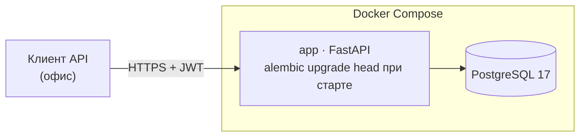
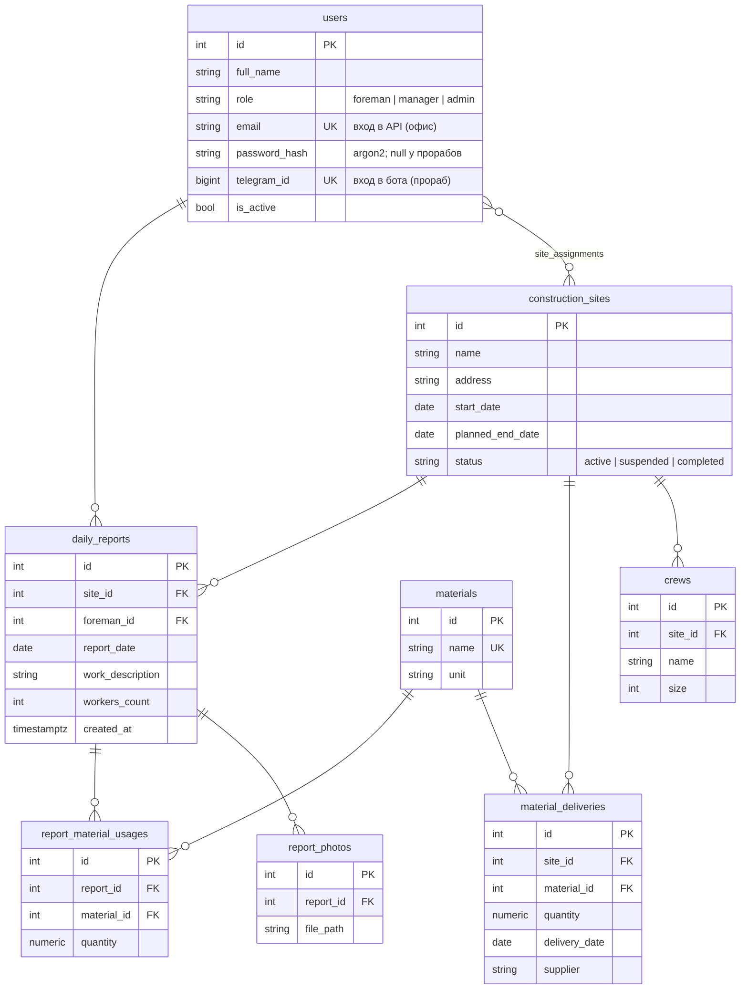

# StroyTrack

[](https://github.com/sa1vador77/stroy-track/actions/workflows/ci.yml)

Сервис учёта строительных площадок для небольшой строительной компании.
Прорабы сдают ежедневные отчёты с объектов через Telegram-бота, офис видит
сводку по объектам на веб-дашборде: лента отчётов с фото, динамика численности
рабочих, расход материалов план/факт.

**Роли:** прораб (отчёты по своим объектам через бота) · менеджер (все объекты,
дашборд, справочники) · админ (управление пользователями).

**Стек:** Python 3.12 · FastAPI · SQLAlchemy 2.0 (async) · Alembic · PostgreSQL ·
aiogram 3 · APScheduler · Jinja2 + htmx · Docker Compose · uv · ruff · pytest

## Быстрый старт

```bash
cp .env.example .env
docker compose up --build
curl http://localhost:8000/health   # → {"status":"ok"}
```

Первый администратор создаётся из консоли — в свежей базе некому выдать права через API:

```bash
docker compose exec app python -m app.cli create-admin --email admin@example.com
```

Swagger UI: http://localhost:8000/docs

## Архитектура



Всё приложение — один Python-пакет `app` и один Docker-образ. API, Telegram-бот
и планировщик напоминаний — отдельные процессы этого образа с общими моделями
и бизнес-логикой; в compose они различаются только командой запуска.

```
app/
├── main.py       # сборка FastAPI-приложения
├── cli.py        # служебные команды: create-admin
├── core/         # конфиг, подключение к БД, безопасность, логирование
├── api/          # HTTP-слой: роутеры и зависимости (health, auth, users, sites, crews, materials)
├── models/       # SQLAlchemy-модели предметной области
└── schemas/      # Pydantic-схемы запросов и ответов
migrations/       # Alembic (async), автогенерация против моделей
tests/            # pytest: изолированная тестовая БД, httpx-клиент
```

## Схема БД



Один отчёт прораба по объекту за день — `UNIQUE (site_id, foreman_id, report_date)`.
Каскады данных (`ON DELETE CASCADE`) — на стороне БД; справочники и авторы
отчётов защищены `RESTRICT`: историю нельзя удалить неявно.

## Разработка

```bash
uv sync                        # окружение и зависимости
docker compose up -d postgres  # БД для локального запуска и тестов
uv run alembic upgrade head    # схема дев-базы
uv run pytest                  # тесты (сами создают БД stroytrack_test)
uv run ruff check . && uv run ruff format --check .
```

Новая миграция после изменения моделей:

```bash
uv run alembic revision --autogenerate -m "описание"
```

Тесты ходят в настоящий PostgreSQL: каждый тест выполняется во внешней
транзакции с SAVEPOINT-ами и откатывается целиком, поэтому `commit()`
в коде приложения работает как в проде, а база между тестами чистая.
CI (GitHub Actions) гоняет линт, миграции, `alembic check` и тесты
на service-контейнере PostgreSQL.

## Архитектурные решения и почему

- **Один пакет, один образ, несколько процессов.** Микросервисы для системы
  такого размера — накладные расходы без выгоды; общие модели исключают
  дублирование, а процессы масштабируются независимо командой запуска.
- **uv вместо pip/poetry.** Детерминированные сборки через `uv.lock`, сам
  ставит нужный Python; в Dockerfile слой зависимостей кешируется отдельно
  от кода приложения.
- **DSN собирается из `POSTGRES_*`.** Те же переменные инициализируют контейнер
  postgres — один источник правды, рассинхрон учётных данных невозможен.
- **JWT: только access-токен, в токене один клейм `sub`.** Роль читается из БД
  на каждый запрос — смена прав и деактивация действуют мгновенно. Refresh-токенов
  нет: клиент — офисный веб, короткий TTL и перелогин дешевле лишнего контура.
- **pwdlib (argon2) + PyJWT.** Активно поддерживаемая связка, рекомендованная
  документацией FastAPI (passlib и python-jose заброшены). Верификация argon2 —
  CPU-bound, поэтому выполняется в тредпуле; при неизвестном email проверяется
  фиктивный хэш, чтобы время ответа не раскрывало базу адресов.
- **Fail-fast конфигурация.** С дефолтными `SECRET_KEY` или паролем БД приложение
  в prod-окружении не стартует; настройки валидируются pydantic-settings при запуске.
- **Enum'ы как VARCHAR, не нативный PG ENUM.** Новое значение статуса или роли
  не требует `ALTER TYPE` в миграции.
- **Naming convention для констрейнтов.** Имена индексов и ограничений
  детерминированы — autogenerate-миграции воспроизводимы, а тексты ошибок БД
  указывают на конкретное ограничение.
- **Тесты на реальном PostgreSQL, не SQLite.** Проверяется то, что поедет
  в прод: диалект, констрейнты, каскады. Изоляция — транзакцией, а не
  пересозданием схемы, поэтому весь прогон занимает пару секунд.
- **Миграции при старте контейнера.** `alembic upgrade head` перед uvicorn:
  одна реплика приложения — гонок за DDL нет, а окружение всегда на актуальной схеме.

## Статус разработки

- [x] Скелет: Docker Compose, healthcheck, CI (ruff + pytest)
- [x] Модели домена, миграции Alembic, JWT-аутентификация и роли
- [ ] CRUD API по сущностям с правами по ролям
- [ ] Telegram-бот: диалог сдачи ежедневного отчёта
- [ ] Напоминания о несданных отчётах (APScheduler)
- [ ] Дашборд: карточки объектов, график численности, материалы план/факт
- [ ] Сводка за период и выгрузка в Excel
